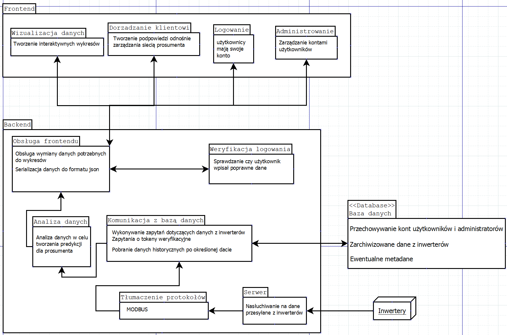

# Prosument

Projekt "Prosument" realizowany w ramach PZSP2 na WEiTI PW
## Cel projektu
Celem projektu jest utworzenie sieciowej aplikacji do wizualizacji danych opisujących gospodarkę energetyczną
u klientów. Na prośbę klienta położyliśmy szczególny nacisk na biznesowy aspekt, czyli sprawiliśmy, aby program
był przygotowany na realne zastosowanie w przemyśle.
Dane zbierane są po stronie klienta przez specjalne urządzenia znane jako ”inwertery”, do których podłączone
są urządzenia, z których korzysta klient. Dalej są one wysyłane na serwer, skąd trafiają do bazy danych, z której
mogą być odzyskane przez klienta.

## Użyte technologie

<p align="center">
  <a href="https://skillicons.dev">
    
  </a>
</p>

Frontend
* Javascript
* React.js

Backend
* Java
* Spring Boot

Database:
* MySQL

## Instalacja

**[WIP]** Tu będzie opisana instalacja środowiska projektu.

```bash
echo "Hello world!"
```

## Jak korzystać z aplikacji

**[WIP]** Opis działania aplikacji

## Wnętrze aplikacji



## License

**[WIP]** Licencja
